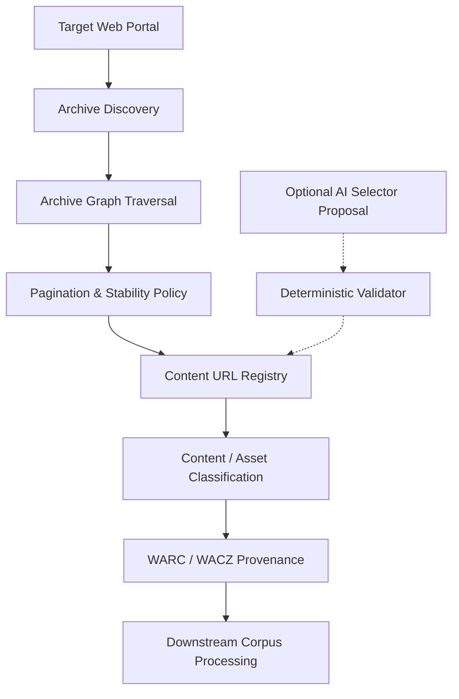

<div align="center">

# CorpusAI

**Robust, reproducible web-corpus crawling and archival workflows**

An experimental research prototype for deterministic discovery, revisit policies, multi-level archive traversal, and WARC provenance in digital preservation and corpus construction.

[](https://www.python.org/downloads/)
[](LICENSE)
[](https://github.com/azharali8/CorpusAi/actions)
[]()
[]()

</div>

---

## Overview

**CorpusAI** investigates how to reliably discover, revisit, classify, and preserve web content for corpus-building workflows. Modern web portals present significant preservation challenges:
- **Unstable pagination** and mid-crawl archive content shifts
- **Nested category, topic, and forum taxonomies** with cycles and deep links
- **Access gates**, interstitial consent barriers, and redirect chains
- **Multi-page articles** split across sequential component URLs
- **Structured content-bearing JSON** alongside rendered HTML
- **Heterogeneous WARC files** mixing primary text with secondary page assets (CSS, JS, images, fonts)

CorpusAI evaluates deterministic crawler algorithms, tamper-evident archival storage layouts, and architectural boundaries to make corpus acquisition inspectable, reproducible, and verifiable.

---

## Feature Overview

| Area | Current Capability | Scope |
| :--- | :--- | :--- |
| **Archive Discovery** | DOM-based article URL discovery using semantic selectors and path filtering | Deterministic / Live validated |
| **Pagination Stability** | Bounded revisit policies, ordered/unordered fingerprints, and head-page sentinels | Synthetic benchmarks |
| **Nested Archives** | Bounded BFS/DFS graph traversal with domain scoping, budgets, and cycle detection | Synthetic benchmarks |
| **Navigation Gates** | Finite state-machine handling for age gates, consent pages, and redirect chains | Synthetic benchmarks |
| **Multi-page Articles** | Logical multi-component assembly with complete/incomplete provenance tracking | Synthetic benchmarks |
| **Archival Storage** | WARC response generation with ISO 28500 record IDs, timestamps, and SHA-256 digests | warcio integration |
| **Content Separation** | Strict separation of content-bearing records (`content_html`, `content_json`) from assets | MIME-based classifier |
| **Replay & QA Foundation** | Replay validation, tamper-evident manifests, and Browsertrix QA integration foundation | Phase 6A Foundation |
| **Incremental Crawling** | Head sentinel verification, boundary reconciliation, change classification, and run catalog | Phase 6B.1 Multi-Page & Incremental |
| **Durable Storage & Deposit** | Immutable run directories (`ArchiveRun`), catalog indexing, and deposit metadata schema | Storage layout design |
| **Real-World Validation** | Polite, bounded discovery, HTML capture, REST JSON, and baseline pilot on WordPress News | Live WordPress validation |
| **AI Selector Proposal** | *Optional secondary module:* Local LLM selector generation with deterministic validation | Experimental (`Ollama`) |

---

## Current Status

- **Offline Unit Test Suite:** **202 passing tests** verified in an isolated offline environment (`202 / 202 tests passing`).
- **Deterministic Synthetic WARC Fixtures:** Generated automatically via `tests/fixtures/generate_warc_fixtures.py` and pytest session hooks (`conftest.py`). Clean CI checkouts reliably reproduce the required test WARCs without storing binary blobs in Git.
- **Continuous Integration:** Automated GitHub Actions workflow (`.github/workflows/tests.yml`) executing fixture generation and offline tests on Python 3.11.
- **Controlled Synthetic Experiments:** 100% test scenario completion across simulated unstable pagination, multi-level graph topologies, navigation gates, and incremental mutation benchmarks (Scenarios A through N).
- **Real-World WordPress News Validation:**
  - **Phase 5A Discovery:** 10/10 article URLs matched the manually collected ground-truth sample with matching ordering.
  - **Phase 5B HTML Capture:** 3 sampled articles captured with title, publication date, author, canonical URL, and body text manually verified.
  - **Phase 5C Structured Content:** Confirmed authoritative article text in structured WordPress REST JSON matching HTML text with 1.0 normalized Jaccard word similarity.
  - **Phase 6A Browser-Backed Archive & Replay (Complete):** Single-page bounded capture (`webrecorder/browsertrix-crawler:1.2.0`) executed against `https://wordpress.org/news/2026/09/owa-president/`. Generated replayable WACZ (1.08 MB) and bounded QA WACZ (141 KB). Browsertrix QA confirmed `screenshotMatch = 1.0` (exact visual match). Manual offline replay verification in ReplayWeb.page succeeded (`manual_replay_verified = true`).
  - **Phase 6B Incremental Architecture (Complete):** Head sentinel verification, boundary reconciliation, anomaly detection, and run catalog implemented. 14 deterministic synthetic mutation scenarios (A–N) validated: stable archive reuse, new article detection, cross-page boundary shifts, content/metadata changes, fetch failures, budget exhaustion, access-gate detection, and multi-run lineage.
  - **Phase 6B.1 Real Incremental Validation & Multi-Page Baseline (Complete):**
    - *Real no-change incremental reuse validated.* Executed against live WordPress News (`https://wordpress.org/news/all-posts/`). Head fingerprint was unchanged; 10 known article states were reused with `content_capture_status: REUSED`. Only 1 live HTTP request made (head check). This validates the NO-CHANGE / REUSE path on a real archive.
    - *Bounded five-page baseline established.* Traversed 5 archive pages; discovered 50 canonical article URLs. Full HTML bodies captured for 10 newest articles (`CAPTURED`). Remaining 40 article states registered without content fetch (`NOT_CAPTURED_IN_PILOT`). Exactly 15 live HTTP requests made. `scope_completion: MULTIPAGE_PILOT_COMPLETE`, `full_portal_coverage: false`.
    - *Manual multi-page sanity review passed.* Project owner verified sampled articles from Page 1 (head + feature article), Page 3 (interior), and Page 5 (boundary). `manual_multipage_review_verified: true`.
    - *Tamper-evident integrity:* SHA-256 checksums verified across all three run directories (`baseline/`, `incremental_run/`, `multipage_baseline/`). Atomic catalog indexing preserves full three-run lineage.
    - *Real naturally occurring change handling remains pending.* The NEW article insertion, cross-page boundary shift, and content/metadata change paths are currently validated only via synthetic offline scenarios. The next real experiment should execute a bounded multi-page incremental run using `run-20261007T193716Z-wpnews-multi` as the previous compatible baseline.

> [!NOTE]
> All reported results are from controlled synthetic scenarios and bounded real-world pilots (`https://wordpress.org/news/all-posts/`). Real no-change incremental reuse was validated. Real-world incremental change handling (new articles, mutations, boundary shifts) remains pending real-world validation. `full_portal_coverage = false` for all pilots.

---

## Architecture



*(AI selector proposal operates strictly as an optional side component outside the primary crawling pipeline).*

---

## Why CorpusAI?

Standard web scrapers often assume static pagination and flat URL hierarchies. In real preservation workflows, portals fail in subtle ways:
1. **Mid-Crawl Mutations:** Articles published during a crawl shift paginated pages, causing crawlers to miss articles at the head of the archive.
2. **Infinite Traversal Loops:** Deeply nested forum categories or calendar views trap crawlers in unbounded traversals.
3. **Multi-Component Fragmentation:** Multi-page articles are stored as disconnected records rather than coherent textual documents.
4. **Mixed Archive Bloat:** Archiving entire page asset trees complicates downstream text-mining pipelines that only require clean HTML or structured JSON.

CorpusAI implements explicit state tracking, visit budgets, and provenance registries to address these failure modes systematically.

---

## Core Design Principles

- **Deterministic Execution:** Core crawl traversal, state transitions, and extraction operate deterministically.
- **Explicit Provenance:** Every URL and record preserves its discovery path, archive origin, HTTP headers, and SHA-256 payload digest.
- **Bounded Revisit Policies:** Head verification and boundary reconciliation operate within strict request budgets.
- **No Silent Failures:** Incomplete multi-page articles, gate blocks, and budget exhaustion are explicitly classified.
- **Content vs. Asset Separation:** Content-bearing text is isolated from presentation assets in archival outputs.
- **Offline Reproducibility:** Core algorithms are tested against local fixtures without requiring network access.
- **AI Safety Boundary:** Where AI modules are explored:
  > *AI proposes. Deterministic systems validate. Human approval remains explicit.*
- **Human Review Boundary:**
  > *Real-world results are manually verified before being treated as validated.*

---

## Implemented Components

### 1. Crawling & Discovery
- **Archive Discovery (`src/archive_page_discovery.py`):** Structural DOM analysis for candidate article links with canonical path filtering.
- **Content URL Registry (`src/content_url_registry.py`):** Dedicated registry tracking article URLs, HTTP metadata, capture status, and WARC record IDs.
- **Multi-Level Graph Traversal (`src/archive_graph_policy.py`):** BFS/DFS graph traversals with cycle detection, domain scoping, and explicit node budgets.

### 2. Stability & Updating
- **Archive Visit Policies (`src/archive_visit_policy.py`):** Ordered/unordered page fingerprinting and mutation-resilient revisit policies.
- **Head-Page Verification (`src/head_verification.py`):** Sentinel polling and boundary reconciliation to detect mid-crawl archive insertions.

### 3. Content Handling & Gates
- **Navigation Gate Policy (`src/navigation_gate_policy.py`):** State-machine modeling for age gates, consent screens, redirect chains, and session cookie reuse.
- **Multi-Page Article Policy (`src/multipage_article_policy.py`):** Logical document collation tracking sequential component URLs.
- **Article Inspector (`src/article_inspector.py`):** Metadata extraction, referenced asset discovery, lazy-load detection, and content JSON classification.

### 4. Archival, Replay & Provenance
- **WARC Utilities (`src/warc_utils.py`):** Parsing, creating, and validating ISO 28500 WARC/WARC.GZ records with custom provenance headers.
- **Archive Run Model (`src/archive_run.py`):** Deterministic run IDs (`run-<timestamp>-<config-hash>`), metadata logging, and immutable execution tracking.
- **Replay Validation (`src/replay_validation.py`):** Manifest validation, SHA-256 tamper-evident integrity checking, and manual replay barrier enforcement.
- **Deposit Metadata (`src/deposit_metadata.py`):** Schemas for Zenodo/Dataverse research corpus deposits with rights declarations and collection provenance.
- **Content Separation:** Dedicated separate outputs for HTML content (`content_html.warc.gz`), structured JSON (`content_json.warc.gz`), and supporting assets (`assets.warc.gz`).

### 5. Experimental AI Module
- **Rule Generator & Repair (`src/rule_generator.py`, `src/rule_repair.py`):** Prompt-driven selector generation via local Ollama models (`qwen2.5-coder:3b`) with schema constraints and statistical validation ($\ge 90\%$).

---

## Real-World Validation

Evaluated against **WordPress News** (`https://wordpress.org/news/all-posts/`):

- **Phase 5A — Article Discovery:**
  - Automated discovery independently extracted the first 10 articles without prior knowledge of the manual ground truth.
  - Achieved **10/10 exact set matches** with identical chronological ordering in the captured snapshot.
- **Phase 5B — HTML Content Capture:**
  - Polite sequential capture of the first 3 discovered articles with a 1.5s delay.
  - Extracted metadata (titles, publication dates, authors, canonical URLs) was manually verified against live pages.
  - Created isolated `content_html.warc.gz` (3 records, SHA-256 verified).
- **Phase 5C — Structured Content Investigation:**
  - Controlled query to the WordPress REST API (`/wp-json/wp/v2/posts?slug=owa-president`).
  - Confirmed structured `content.rendered` availability matching HTML body text with 1.0 normalized Jaccard word similarity.
  - Cataloged 23 referenced assets (images, CSS, JS, fonts) and lazy-load indicators.
- **Phase 6A — Browser-Backed Archive & Replay (Complete):**
  - Executed controlled single-page capture using `webrecorder/browsertrix-crawler:1.2.0` with autoscroll/autofetch behaviors and text extraction.
  - Generated intact standard WACZ (`wordpress-owa-president.wacz`, 1,088,595 bytes, SHA-256 verified) and QA WACZ (`wordpress-owa-president-qa-corrected.wacz`, 141,793 bytes, SHA-256 verified).
  - Browsertrix QA confirmed `screenshotMatch = 1.0` (0 pixel difference between capture and replay). Text comparison was unavailable as the crawl did not create an isolated `urn:text` WARC record.
  - Resource counts identified 30 replayed assets, 5 upstream theme SVG 404s, and 3 deferred tracking endpoints (all non-critical for article reading).
  - Human manual inspection in ReplayWeb.page succeeded, confirming full article text, headline, date, author, and main image render faithfully offline (`manual_replay_verified = true`).
  - Maintained strict separation between primary corpus content (`content_html.warc.gz`, `content_json.warc.gz`) and supporting replay assets.
  - Calculated SHA-256 tamper-evident checksums across all artifacts in `checksums.sha256`.

---

## Experimental Results Summary

| Experiment | Observed Result | Evaluation Scope |
| :--- | :--- | :--- |
| **WARC MIME Classification** | HTML records separated from mixed page assets with 100% precision | Synthetic fixture |
| **Pagination Mutation** | Bounded revisit policy improved empirical archive coverage in tested scenarios | Synthetic simulation |
| **Head Verification** | Sentinel checking detected tested mid-crawl head-page insertions | Synthetic simulation |
| **Multi-Level Traversal** | Bounded BFS/DFS traversed nested taxonomy graphs without infinite loops | Synthetic simulation |
| **Gate / Multi-Page Handling** | Resolved valid gates; flagged broken/missing components as incomplete | Synthetic simulation |
| **WordPress Discovery** | 10/10 candidate article URLs matched manual human ground truth | Real-world validation |
| **Article HTML Capture** | 3/3 sampled articles captured and manually verified against live metadata | Real-world validation |
| **WordPress REST JSON** | Authoritative article body text confirmed in ~7 KB JSON vs. ~154 KB HTML | Real-world validation |
| **Archive Run & Integrity** | Deterministic run IDs, SHA-256 manifests, and deposit schema validated | Phase 6A Foundation |

---

## Project Structure

```
CorpusAI/
├── .github/
│   └── workflows/
│       └── tests.yml                              # GitHub Actions offline CI workflow
├── config/                                        # Extraction schema and selector configurations
├── data/                                          # Local HTML sample fixtures
├── docs/                                          # Architecture specifications and design docs
│   └── archive_storage_design.md                  # Durable run directory layout and deposit design
├── experiments/                                   # LLM and WARC selector experiments
│   ├── run_real_llm_experiment.py
│   ├── run_repair_demo.py
│   └── run_warc_selector_experiment.py
├── research/                                      # Specialized research tracks and benchmarks
│   ├── archiving/                                 # WARC storage and mixed-content analysis
│   │   ├── current_tools.md
│   │   ├── mixed_content_findings.md
│   │   └── experiments/
│   │       ├── create_mixed_warc.py
│   │       ├── inspect_warc_records.py
│   │       └── run_mixed_content_analysis.py
│   ├── crawling/                                  # Crawl stability and graph traversal benchmarks
│   │   ├── gated_navigation_findings.md
│   │   ├── multilevel_findings.md
│   │   ├── pagination_instability.md
│   │   └── experiments/
│   │       ├── run_gated_navigation_experiment.py
│   │       ├── run_head_verification_experiment.py
│   │       ├── run_multilevel_experiment.py
│   │       └── run_stability_experiment.py
│   └── real_world/                                # Real-world portal capture and validation
│       └── wordpress/
│           ├── article_capture_checklist.md
│           ├── manual_ground_truth.txt
│           ├── phase6a_replay_checklist.md
│           ├── replay_checklist.md
│           ├── run_article_capture_validation.py
│           ├── run_asset_capture_validation.py
│           ├── run_discovery_validation.py
│           └── run_phase6a_validation.py
├── results/                                       # Structured JSON manifests and metrics
├── src/                                           # Core library implementation
│   ├── archive_catalog.py
│   ├── archive_graph_policy.py
│   ├── archive_page_discovery.py
│   ├── archive_run.py
│   ├── archive_visit_policy.py
│   ├── article_inspector.py
│   ├── content_url_registry.py
│   ├── deposit_metadata.py
│   ├── downloader.py
│   ├── evaluator.py
│   ├── extractor.py
│   ├── head_verification.py
│   ├── html_preprocessor.py
│   ├── incremental_archive_policy.py
│   ├── incremental_run.py
│   ├── multipage_article_policy.py
│   ├── navigation_gate_policy.py
│   ├── portal_state.py
│   ├── replay_validation.py
│   ├── rule_generator.py
│   ├── rule_repair.py
│   ├── run_comparison.py
│   ├── selector_validator.py
│   ├── warc_utils.py
│   └── webarticlecurator_adapter.py
├── tests/                                         # Comprehensive offline unit test suite (202 tests)
│   ├── fixtures/
│   │   └── generate_warc_fixtures.py
│   ├── test_archive_graph_policy.py
│   ├── test_archive_page_discovery.py
│   ├── test_archive_visit_policy.py
│   ├── test_article_capture.py
│   ├── test_asset_capture_replay.py
│   ├── test_extractor.py
│   ├── test_fixture_generator.py
│   ├── test_head_verification.py
│   ├── test_html_preprocessor.py
│   ├── test_incremental_crawling.py
│   ├── test_navigation_gate_policy.py
│   ├── test_ollama_generator.py
│   ├── test_replay_validation.py
│   ├── test_rule_repair.py
│   ├── test_validator.py
│   ├── test_warc_adapter.py
│   ├── test_warc_classification.py
│   └── test_warc_utils.py
├── pyproject.toml
├── requirements.txt
└── README.md
```

---

## Installation

### Prerequisites
- Python 3.11+
- Virtual environment tool (`venv` or `uv`)

```bash
git clone https://github.com/azharali8/CorpusAi.git
cd CorpusAi

python -m venv .venv

# On Windows:
.venv\Scripts\activate

# On Linux / macOS:
source .venv/bin/activate

pip install -r requirements.txt
```

---

## Quick Start

### 1. Run the Offline Test Suite
```bash
pytest -v
```

### 2. Run Real-World Validation Scripts
```bash
# Validate article discovery against WordPress News
python research/real_world/wordpress/run_discovery_validation.py

# Execute polite capture of sampled articles into Content WARC
python research/real_world/wordpress/run_article_capture_validation.py

# Perform asset inventory and REST API JSON investigation
python research/real_world/wordpress/run_asset_capture_validation.py

# Execute Phase 6A archive manifest, environment inspection, and checksum generation
python research/real_world/wordpress/run_phase6a_validation.py
```

### 3. Run Synthetic Crawl Stability Benchmarks
```bash
# Run unstable pagination simulation
python research/crawling/experiments/run_stability_experiment.py

# Run head-page verification benchmark
python research/crawling/experiments/run_head_verification_experiment.py

# Run multi-level archive traversal benchmark
python research/crawling/experiments/run_multilevel_experiment.py

# Run gated navigation and multi-page assembly simulation
python research/crawling/experiments/run_gated_navigation_experiment.py
```

---

## Testing

All standard unit tests run completely **offline** using local fixtures and deterministic mock responders.

In CI and fresh repository checkouts, synthetic WARC fixtures (`synthetic_portal.warc`, `mixed_content_test.warc`) are deterministically generated via `tests/fixtures/generate_warc_fixtures.py` (or automatically via `conftest.py`).

Continuous Integration (`.github/workflows/tests.yml`) executes:
1. Deterministic synthetic WARC fixture generation (`python tests/fixtures/generate_warc_fixtures.py`)
2. Full offline pytest suite (`pytest -v`)

```bash
pytest -v
```

**Current offline test suite:** `202 passing tests` (`202 / 202 tests passing`, 0 failures, 0 errors).
 
 ---
 
 ## WARC & Content Architecture
 
 CorpusAI enforces a strict distinction between primary content records and secondary presentation resources:
 
 - **`content_html.warc.gz`:** Contains HTTP response records for known article URLs.
 - **`content_json.warc.gz`:** Contains verified structured content JSON (e.g. WordPress REST API posts).
 - **`assets.warc.gz`:** Reserved exclusively for fetched supporting assets (CSS, JS, images, fonts).
 - **Replay Packages (`.wacz`):** Preserves full browser-level fidelity intact for historical replaying in ReplayWeb.page.
 
 Every record stores immutable metadata in its WARC record headers (`WARC-Record-ID`, `WARC-Target-URI`, `WARC-Date`, `WARC-Source-Archive`, and SHA-256 payload digest).
 
 ---
 
 ## Experimental AI Assistance
 
 An experimental secondary module explores AI-assisted selector proposal using local LLMs:
 
 - **Constrained Inference:** Uses local Ollama models (`qwen2.5-coder:3b`) with zero cloud data transmission.
 - **Strict Verification:** Proposed CSS/XPath selectors must pass statistical validation ($\ge 90\%$ match rate, non-empty values) against representative HTML samples.
 - **Human Approval:** Repaired selector rules are never automatically deployed into production configurations without explicit review.
 - **Separation from Crawler:** AI inference has no role in URL discovery, traversal, or HTTP execution.
 
 ---
 
 ## Limitations
 
 - **Prototype Scope:** CorpusAI is an experimental research framework, not a distributed production web crawler.
 - **Limited Portal Coverage:** Real-world validation has currently been conducted on a single WordPress News article and its archive index.
 - **Replay Scope:** Browser-backed visual replay has been validated on a single WordPress article in Phase 6A; multi-page full portal replay remains future work.
 - **No Access Bypasses:** CorpusAI does not attempt to bypass CAPTCHAs, paywalls, or authentication barriers.
- **Synthetic Generalization:** Benchmark results on simulated portal mutations reflect controlled conditions and may not directly generalize to all CMS architectures.
- **Politeness:** Crawling relies on polite rate-limiting (1–2s delays) and explicit `robots.txt` compliance.

---

## Responsible Crawling

When executing live real-world experiments, CorpusAI:
- Checks and complies with `robots.txt` directives.
- Uses an identifiable, academic research User-Agent.
- Enforces strict request timeouts (15s) and bounded retry counts.
- Restricts requests to sequential, low-frequency execution.
- Terminates immediately upon receiving access restriction or error responses.

---

## Roadmap

1. **Browser-Backed Replay / QA:** Containerized Browsertrix capture and automated replay QA auditing.
2. **Incremental Full-Portal Crawling:** Head-page sentinel monitoring and state reconciliation across complete portal runs.
3. **Durable Storage & Repository Deposit:** Automated catalog indexing and Zenodo/Dataverse deposit manifest creation.
4. **Difficult & Non-Regular Portals:** Real-world validation on forums, bulletin boards, and deep-link structures.
5. **Downstream Corpus Services:** Full TEI/XML transformation pipelines and linguistic text-mining ingestion.

---

## License

CorpusAI source code and project documentation are licensed under the [Apache License 2.0](LICENSE).

### Third-Party Content

The Apache License 2.0 applies to original CorpusAI source code and project documentation unless otherwise noted.

Archived web pages, WARC/WACZ captures, images, CSS, JavaScript, fonts, datasets, and other third-party materials retain the rights and licensing conditions of their original owners.

CorpusAI's license does not grant redistribution or sublicensing rights for third-party web content captured during research experiments. See [THIRD_PARTY_NOTICES.md](THIRD_PARTY_NOTICES.md) for details on external software components and attributions.

