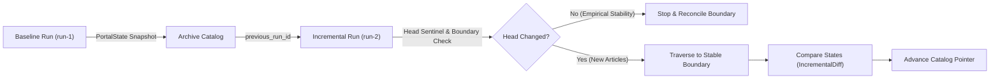

# Incremental Crawling Architecture and Design Specification (Phase 6B)

## 1. Overview
This document specifies the incremental discovery, state synchronization, lineage, and anomaly-detection architecture implemented for **CorpusAI Phase 6B**. 

The goal of incremental crawling is to maintain up-to-date corpus archives of web portals over time by:
1. Reusing previously verified stable archive pages and article representations.
2. Checking the newest/head section first to detect newly published articles (head sentinel verification).
3. Reconciling pagination boundary shifts when mid-crawl or inter-crawl insertions occur.
4. Detecting unexpected structural anomalies (access gates, empty head pages, DOM redesigns) and requiring human review rather than silently corrupting data.
5. Preserving run-to-run lineage in an immutable storage layout with tamper-evident SHA-256 integrity metadata.

---

## 2. Baseline Run vs. Incremental Run Model

CorpusAI establishes an explicit two-run paradigm:

- **Baseline Run (`mode: BASELINE`):**
  - Establishes the initial snapshot of known archive state.
  - Traverses the archive pages to discover article URLs, compute page fingerprints, and record metadata.
  - Produces a `PortalState` snapshot and records the run in `ArchiveCatalog`.

- **Incremental Run (`mode: INCREMENTAL`):**
  - References `previous_run_id` from the prior successful run.
  - Compares current observations against the previous `PortalState`.
  - Classifies articles as `NEW`, `UNCHANGED`, `CONTENT_CHANGED`, `METADATA_CHANGED`, `MISSING`, or `FETCH_FAILED`.
  - Only advances the `latest_successful_run_id` pointer in the catalog upon successful convergence.



---

## 3. Multi-Level State & Identity Representation

### 3.1 Archive Pages
Each archive page is identified by:
- **Canonical URL:** Normalized URL (stripped of tracking query parameters and fragments).
- **Ordered Fingerprint:** SHA-256 digest of exact discovered URL sequence (`\n.join(urls)`).
- **Unordered Fingerprint:** SHA-256 digest of sorted unique URL set (`\n.join(sorted(set(urls)))`).
- **Pagination Structure:** Next and previous page links.

### 3.2 Articles
Articles are classified via distinct representations:
- **Canonical URL:** Normalized article URL.
- **Content Hash:** SHA-256 digest of normalized body text.
- **Raw Representation Hash:** SHA-256 of raw HTTP payload.
- **Metadata Fingerprint:** Tuple of `(title, published_at, author)`.

---

## 4. Head-Page Sentinel and Boundary Strategy

### 4.1 Head Sentinel Verification
- **Principle:** On modern web portals (blogs, news outlets), new articles are inserted at the head of the archive.
- **Mechanism:** The crawler inspects the head archive page (e.g. `/news/all-posts/` or page 1).
- **Decision:**
  - If the head's unordered fingerprint matches the previous run's `head_fingerprint` and previous run was complete:
    - **Empirical stability** is established.
    - Crawl terminates after inspecting the head page (minimal HTTP requests).
  - If the head changed:
    - New URLs are registered as `NEW`.
    - Crawler paginates to page 2 and beyond until reaching an archive page whose unordered fingerprint and pagination match the previous state (`BOUNDARY_RECONCILED`).

### 4.2 Resuming Incomplete Runs
- If a previous run was interrupted or stopped due to budget exhaustion (`last_potentially_incomplete_page` is set), the incremental run explicitly notes the boundary and validates down through that checkpoint before claiming convergence.

---

## 5. Anomaly Detection and Safety Boundaries

CorpusAI treats structural web changes conservatively. When severe anomalies occur, the crawler flags `MANUAL_REVIEW_REQUIRED` and terminates safely rather than producing corrupt data.

| Anomaly Status | Trigger Condition | Crawler Action |
|---|---|---|
| `ACCESS_GATE_DETECTED` | HTTP 401 or 403 response encountered | Stop traversal; flag review |
| `ARCHIVE_EMPTY_UNEXPECTEDLY` | Head archive page contains 0 article links | Stop traversal; flag review |
| `ARCHIVE_COLLAPSED_UNEXPECTEDLY` | Article count drops by > 50% from previous run | Flag review |
| `MASSIVE_UNEXPECTED_REORDERING` | > 80% of common articles reordered | Flag review |
| `BUDGET_EXHAUSTED` | Max page/article/request limits reached | Mark non-converged; record checkpoint |

---

## 6. Immutable Storage Layout and Catalog Lineage

All runs adhere to the durable on-disk directory layout:

```
results/wordpress_validation/phase6b/
├── catalog.json                          # Global lineage index
├── baseline/                             # 1-page baseline snapshot (run-20261007T192416Z-wpnews)
│   ├── manifest.json                     # Scope: PILOT_SCOPE_CONVERGED
│   ├── portal_state.json                 # 10 articles captured
│   ├── run_summary.json
│   ├── incremental_report.md
│   ├── request_log.json
│   └── checksums.sha256
├── incremental_run/                      # 1-page incremental update check (run-20261007T193712Z-wpnews-inc)
│   ├── manifest.json                     # Scope: PILOT_SCOPE_CONVERGED
│   ├── portal_state.json                 # 10 articles reused (content_capture_status: REUSED)
│   ├── diff.json                         # IncrementalDiff against baseline
│   ├── run_summary.json
│   ├── incremental_report.md
│   ├── request_log.json                  # Exactly 1 HTTP request (head check)
│   └── checksums.sha256
└── multipage_baseline/                   # 5-page baseline snapshot (run-20261007T193716Z-wpnews-multi)
    ├── manifest.json                     # Scope: MULTIPAGE_PILOT_COMPLETE
    ├── portal_state.json                 # 50 discovered, 10 captured, 40 NOT_CAPTURED_IN_PILOT
    ├── run_summary.json
    ├── multipage_report.md
    ├── request_log.json                  # Exactly 15 HTTP requests (5 pages + 10 articles)
    └── checksums.sha256
```

### 6.1 Scope Completion vs Full Portal Coverage
To prevent overstating coverage during bounded research pilots:
- `scope_completion`: Explicit enum (`PILOT_SCOPE_CONVERGED`, `MULTIPAGE_PILOT_COMPLETE`, `FULL_PORTAL_CONVERGED`, `INCOMPLETE`).
- `full_portal_coverage`: Boolean flag strictly set to `false` for bounded research experiments.

### 6.2 Partial Scope vs Missing Classification
When executing bounded crawls (e.g. 1 or 2 pages):
- Articles known in prior larger runs that are not encountered within the bounded scope are classified as `not_observed_in_scope` rather than falsely flagged as `missing_candidates`.
- Deletion claims require comprehensive multi-page traversal confirming absence.

### 6.3 Article Content Capture Status
For scalable multi-page baseline indexing:
- `CAPTURED`: Full HTML payload fetched, parsed, and hashed.
- `NOT_CAPTURED_IN_PILOT`: Article URL and pagination lineage registered; body fetch intentionally deferred to conserve bandwidth.
- `REUSED`: Prior captured hashes and metadata carried forward without live HTTP requests when head archive is unchanged.
- `FAILED`: Live fetch failed.

### 6.4 Atomic Updates & Failure Isolation
1. **Atomic Writes:** All state files (`portal_state.json`, `manifest.json`, `catalog.json`) are written to temporary files (`<name>.tmp.<pid>`), synced to disk (`os.fsync`), and replaced atomically (`os.replace`).
2. **Failure Isolation:** If an incremental run fails or aborts, `ArchiveCatalog.register_run(is_successful=False)` registers the entry in historical records but **never advances** `latest_successful_run_id`.

---

## 7. Phase 6B.1 Real-World Results and Interpretation

### 7.1 Conservative Result Statement

> Phase 6B.1 validated run-to-run incremental state reuse on a real WordPress archive when the head remained unchanged, and established a manually reviewed, bounded five-page baseline for future real incremental comparisons.

The following is a precise accounting of what was and was not validated:

| Claim | Status |
|---|---|
| Incremental architecture implemented and tested synthetically | ✅ Validated (Scenarios A–N) |
| Real no-change incremental reuse validated on live WordPress | ✅ Validated |
| Bounded 5-page baseline established and manually reviewed | ✅ Validated |
| Naturally occurring NEW article insertion validated in real-world | ❌ Pending |
| Real cross-page boundary mutation validated | ❌ Pending |
| Real content/metadata change observed on live portal | ❌ Pending |
| Full portal incremental crawling proven | ❌ Not claimed |
| Production readiness | ❌ Not claimed |

### 7.2 Real Incremental Run Result

- **Factual outcome:** `REAL_INCREMENTAL_NO_CHANGE`
- The head archive fingerprint at the time of the incremental check was identical to the baseline fingerprint.
- All 10 known article states were reused (`content_capture_status: REUSED`) without any new content fetches.
- Exactly 1 live HTTP request was issued (the head page check, plus 1 robots.txt fetch).
- This validates the NO-CHANGE / REUSE path of the incremental algorithm on a real live archive.
- The NEW / CONTENT_CHANGED / cross-page mutation paths remain validated only via synthetic offline scenarios.

### 7.3 Manual Multi-Page Review

The five-page multi-page baseline was manually reviewed by the project owner against live WordPress News archive pages after automated discovery.

- **Samples verified:** Page 1 (head article, feature article), Page 3 (interior), Page 5 (boundary)
- **`manual_multipage_review_verified: true`**
- **`manual_review_status: VERIFIED`** on `run-20261007T193716Z-wpnews-multi`

---

## 8. Compatible Run Lineage

Runs are organized into two independent lineage chains based on their original scope. **These lineages must not be crossed.**

### 8.1 One-Page Lineage

```
run-20261007T192416Z-wpnews   (BASELINE, 1 page, 10 articles, PILOT_SCOPE_CONVERGED)
    ↓  previous_run_id
run-20261007T193712Z-wpnews-inc  (INCREMENTAL, 1 page head check, REAL_INCREMENTAL_NO_CHANGE)
    ↓  future
(next 1-page incremental run, if applicable)
```

### 8.2 Multi-Page Lineage

```
run-20261007T193716Z-wpnews-multi  (BASELINE, 5 pages, 50 discovered, MULTIPAGE_PILOT_COMPLETE, VERIFIED)
    ↓  previous_run_id
(future real multi-page incremental run — REAL_MULTIPAGE_INCREMENTAL_PENDING)
```

> [!IMPORTANT]
> A future 5-page incremental run **MUST** use `previous_run_id = run-20261007T193716Z-wpnews-multi`.
> It **MUST NOT** compare against `run-20261007T192416Z-wpnews` (1-page scope) because incompatible scopes produce false `not_observed_in_scope` classifications for articles on pages 2–5.

### 8.3 Future Real Multi-Page Incremental Run

The next real experiment should be a bounded multi-page incremental run against WordPress News using `run-20261007T193716Z-wpnews-multi` as the previous compatible baseline.

The goal is to observe one of the following natural live changes:
- New article insertion at the head
- Cross-page boundary shift (existing articles pushed to page 2)
- Real metadata or content update on a known article

**Status: `REAL_MULTIPAGE_INCREMENTAL_PENDING`** — Do not execute repeated polling. Execute as a single bounded experiment when ready.


